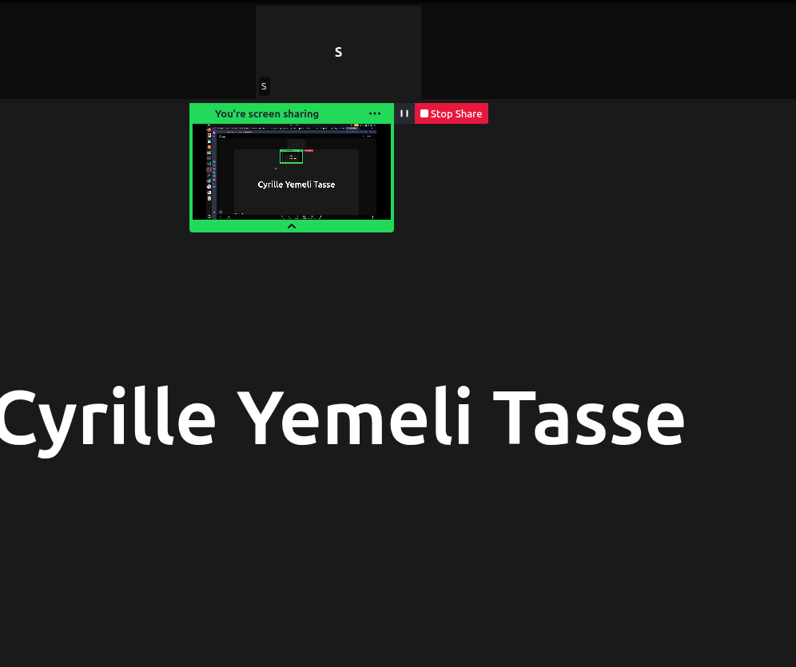

# Instructions to run multiple virtual Connects on your PC

## 1. Prerequisites



* Install **Git**.
* Install **Python**, any recent 3.x version.
* Test that you can run python from the command line.

  * We will assume you run it using `py`.

---

## 2. Do the base project setup if not already done

* Git clone the repository, say to "C:/Projects/AIVA"
* Or, Git pull to get the latest codebase
* Build the AIVA.sln solution
* Run the servers

---

## 3. Install the firmware's Python dependencies

* Open the terminal at the directory "C:/Projects/AIVA/Firmware/"
* Create a new Python virtual environment: `py -m venv venv`.
  This creates a new folder called "venv".
* Activate the Python virtual environment: `.\venv\Scripts\activate`.
* If the activation fails then instead try:

  * `export PATH="/c/Projects/AIVA/Firmware/venv/Scripts:$PATH"`
* Check that your `python` command points to the right program:

  * Use `which python` or `where python` or `Get-Command python` depending on your terminal.
* Tip: add "C:/Projects/AIVA/Firmware/venv/Scripts" to your user environment variables so you do not have to explicitly activate the Python environment every time.
* Finally, download and install the firmware's dependencies using the command:

  * `python -m pip install -r requirements.txt`
* This may take some time. When done, run the command again to make sure all is fine.

---

## 4. Setup one of your virtual Connects

* Create a new folder "local" inside the folder "Firmware".
* Create a new folder for your Connect, say `HomeEntrance`, and cd into it.
* Create a new file `settings.json` with the content below:

```json
{
  "apiserver": "http://localhost:56330/",
  "HW_ADDRESS": "00:00:00:00:00:00",
  "BASE_PORT": "5555",
  "DebugModeEnabled": "True",
  "ImgDir": "img/"
}
```

* Modify the value of HW_ADDRESS accordingly to what was setup on the dashboard.
* Modify the value of BASE_PORT so that it does not clash with that of another virtual Connect.

  * The difference between the base port numbers of your virtual Connects should be at least 1000.
* Modify the value of apiserver to point to UAT or PROD if you want to test those environments.

  * You cannot target an already used Connect because you need to configure camera settings.

---

## 5. Launch your virtual Connect

* Open the terminal at the directory "Firmware/local/HomeEntrance/".
* Ensure that your `python` command points to the right program.
* Execute: `python ../../monitor_service.py`
* The Connect logs are stored in the monitor_output.log file.

---

## 6. Open the Connect's screen app

* Open the dashboard and go to the My Connects page at `/Connects/Index`.
* Locate your Connect and click on the Edit button.
* In the Edit Connect page, scroll to the bottom.
* Click on the link "Click here to preview the screen app". A new page opens.
* Change the query parameters of the URL in the new page, from `?preview=true` to `?fwBasePort=BASE_PORT`, where BASE_PORT must be the same value as in the settings.json file.
* Enter (i.e. validate) the modified URL to reload the page.
* Bookmark the page under the name `HomeEntrance` for ease of access.

---

## 7. Get the URL to connect to the camera

### a. Using your PC's webcam

* Here, the connection URL is simply `0`, so not actually a URL!
* However, only one virtual Connect can access your PC's webcam at a time.

---

### b. Using the Android app: IP Webcam

* App only available on Android.
* Download from the Play Store.
* Open the app, scroll to the bottom and press "Start server".
* You will be presented with the URL to use to access the app's server.
* Suppose this URL is: http://192.168.100.69:8080

---

### Hostname configuration

* The IP address in the URL is that of your phone in the LAN.
* It may change depending on the network.
* To avoid constant updates, define a hostname.
* Open:

  ```
  C:/Windows/System32/drivers/etc/hosts
  ```
* Add:

  ```
  192.168.100.69 my-android
  ```

---

### Video feed access

* If you open:

  ```
  http://my-android:8080
  ```

  you get a webpage.
* The actual video stream is:

  ```
  http://my-android:8080/video
  ```

---

### Video preferences

* By default, the rear camera is used.
* You can change it in the "Video preferences" section.

---

### c. Using the desktop app: VLC

* To be updated...

---

## 8. Setup the LPR camera's URL

### a. Get the URL

* The URL for the LPR camera can be simulated using:

  ```
  http://localhost:56330/api/test/LPR
  ```

---

### b. The LPR value

* Default value: `ABCDEFGH`
* Change it with:

  ```
  ?lpr=<new-value>
  ```
* Delete it with:

  ```
  ?lpr=delete
  ```
* It resets when the server restarts.

---

### c. Set the URL

* Open the dashboard and go to the Edit Device page of your LPR camera device.
* Set the URL only to the `IP Camera Connection` input field.

---

End!

